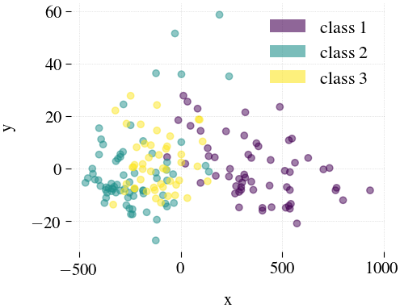
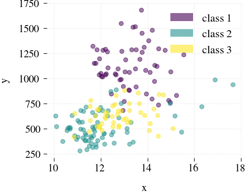
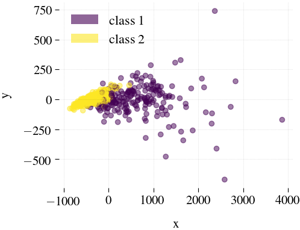

## Mdr (Multilevel dimensionality reduction)

**About**

This is an Python implementation of multilevel dimensionality reduction, published by Alan et. al. [1]. The implementation is based on multilevel approach for combinatorial optimization that can perform in bipartite context.

**Download**

* You can download the Mdr software in http://www.alanvalejo.com.br/software?name=mdr

**Usage**

> Coarsening by levels. The user defines the number of levels and the reduction factor at each level.

	$ python mdr-mob.py [options]
	$ python mdr-opm.py [options]

| Option             | Domain        | Default   | Description                          |
| ------------------ | ------------- | --------- | ------------------------------------ |
| -in --input        | string [FILE] | None      | name of the input file to be loaded  |
| -dir --directory   | string [DIR]  | '.'       | directory of output file             |
| -out --output      | string [FILE] | filename  | name of the file to be save          |
| -cnf --conf        | string [FILE] | None      | name of the config file to be loaded |
| -v --vertices      | int           | None      | number of vertices for each layer    |
| -r --rf            | (0 0.5]       | [0.5 0.5] | reduction factor for each layer      |
| -m --ml            | [0 n]         | [3 3]     | max levels for each layer            |
| -c --matching      | string        | [hem hem] | matching method for each layer       |
| -s --similarity    | string        | None      | similarity measure for each layer    |
| --save_conf        | boolean       | false     | save config file                     |
| --save_ncol        | boolean       | false     | save ncol format                     |
| --save_gml         | boolean       | false     | save gml format                      |
| --save_source      | boolean       | false     | save source reference                |
| --save_predecessor | boolean       | false     | save predecessor reference           |
| --save_successor   | boolean       | false     | save successor reference             |
| --save_hierarchy   | boolean       | false     | save all levels of hierarchy         |
| --save_adjacency   | boolean       | false     | save weighted adjacency matrix       |
| --save_timing_json | boolean       | False     | save timing in json                  |
| --save_timing_csv  | boolean       | False     | save timing in csv                   |
| --show_timing      | boolean       | false     | show timing                          |
| --unique_key       | boolean       | false     | output date and time as unique_key   |

The matching strategy selects the best pairs of vertices for matching. Formally, a matching $M$ can be denoted by a set of pairwise non-adjacent edges, i.e., a set of edges with no common vertices. In this software it is possible use two matching methods:

For mdr-mob.py use:
* Greed Rand Twohopes
* Greed Twohopes

For mdr-opm.py use:
* Hem
* Lem
* Rm

The matching strategy is, therefore, a key component of an effective multilevel optimization, as it leads to a good hierarchy of coarsened networks for supporting the local search algorithm. A poor choice of the matching impairs the multilevel process, hence, the performance of the local search algorithm. In this software it is possible use some similarity measures:

For both scripts, mdr-mob.py and mdr-opm.py you can use:
* Common Neighbors
* Weighted Common Neighbors
* Preferential Attachment
* Jaccard
* Salton
* Adamic Adar
* Resource Allocation
* Sorensen
* Hub Promoted
* Hub Depressed
* Leicht Holme Newman

**Quick benchmark results**

We test a scientific collaboration network (Cond-Mat), available [here](https://toreopsahl.com/datasets/#newman2001), which is based on preprints posted in the Condensed Matter section (arXiv) between 1995 and 1999 and has 38.742 vertices (authors and papers) and 58.595 edges (authorship) among different types of vertices.

	# Mdr using Greed Rand Twohopes coarsening algorithm (Execute more time to find the best result)
	$ python mdr-mob.py -cnf input/iris-mdr-rgmb.json; python plot2Dmdr.py iris

	# Mdr using Greed Twohopes coarsening algorithm
	$ python mdr-mob.py -cnf input/wine-mdr-gmb.json; python plot2Dmdr.py wine
	$ python mdr-mob.py -cnf input/breast-cancer-mdr-gmb.json; python plot2Dmdr.py breast-cancer

	# Principal component analysis (PCA)
	$ python plot2D.py pca iris
	$ python plot2D.py pca wine
	$ python plot2D.py pca breast-cancer

	# Feature Agglomeration
	$ python plot2D.py fa iris
	$ python plot2D.py fa wine
	$ python plot2D.py fa breast-cancer

**Iris**

| Mdr                      | Principal component analysis (PCA) | Feature Agglomeration   |
| ------------------------ | ---------------------------------- | ----------------------- |
|  |            |  |

**Wine**

| Mdr                      | Principal component analysis (PCA) | Feature Agglomeration   |
| ------------------------ | ---------------------------------- | ----------------------- |
|  |            |  |

**Breast Cancer**

| Mdr                               | Principal component analysis (PCA) | Feature Agglomeration            |
| --------------------------------- | ---------------------------------- | -------------------------------- |
|  |   |  |

**Dependencies**

* Python: tested with version 2.7.13.
* Packages required: [igraph](http://igraph.sourceforge.net); [scipy](http://www.scipy.org/); [sklearn](http://scikit-learn.org/); [numpy](http://www.numpy.org/)

**Known Bugs**

Please contact the author for problems and bug report.

**Contact**

* Alan Valejo.
* Ph.D. candidate at University of São Paolo (USP), Brazil.
* alanvalejo@gmail.com.

**License (COPYING.md)**

* Can be used for creating unlimited applications
* Can be distributed in binary or object form only
* Non-commercial use only
* Can modify source-code and distribute modifications (derivative works)
* Giving credit to the author by citing the papers [1,2]
* License will expire in 2018, July, and will be renewed.

**References**
> [1] Valejo, A.; Rocha Filho, G. P.; Oliveira, M. C. F.; and Lopes, A. A.: A Multilevel approach for combinatorial optimization in bipartite networks. Knowledge-Based Systems (2018)

~~~~~{.bib}
@article{Alan_2014,
    author={Valejo, A.; Rocha Filho, G. P.; Oliveira, M. C. F.; and Lopes, A. A.},
    title={Multilevel approach for combinatorial optimization in bipartite networks},
    journal={Knowledge-Based Systems},
    year={2018},
}
~~~~~

 &copy; Copyright (C) 2017 Alan Valejo &lt;alanvalejo@gmail.com&gt; All rights reserved.

